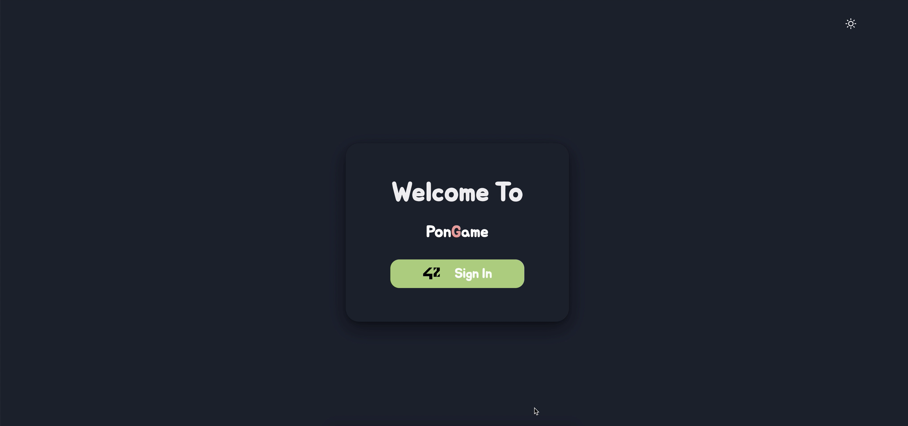
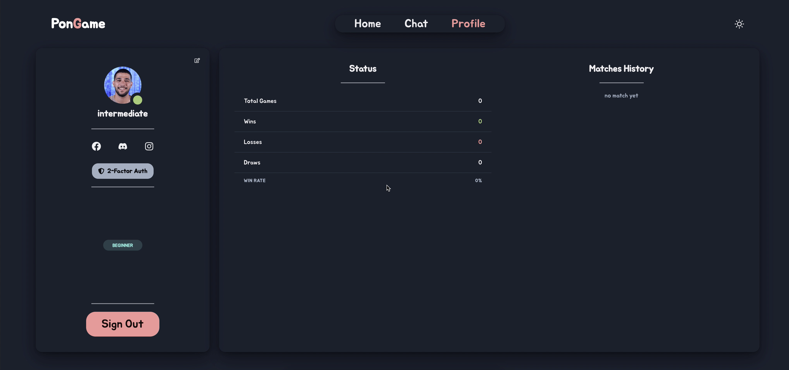
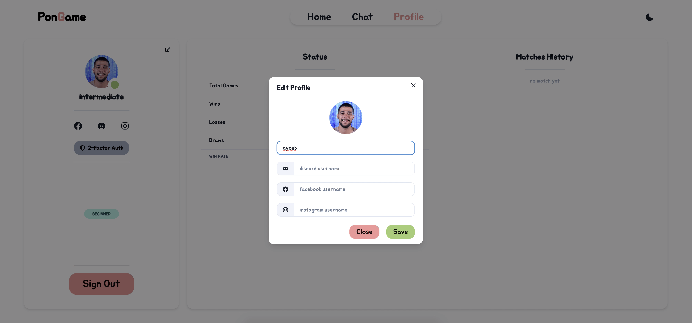
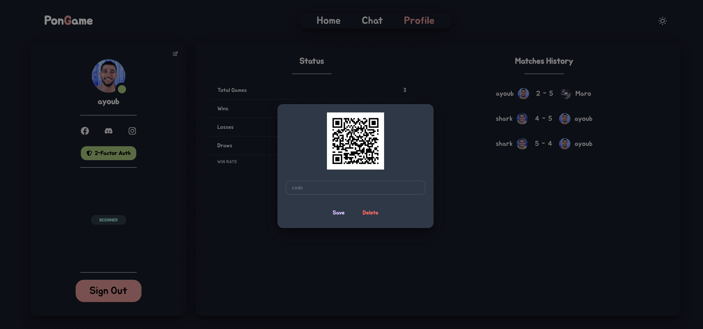
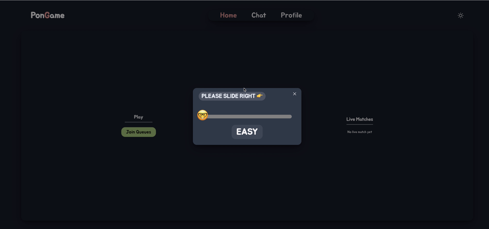
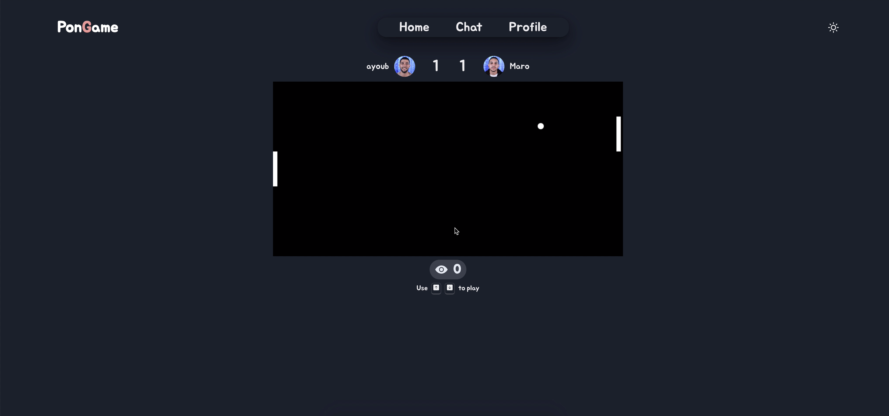
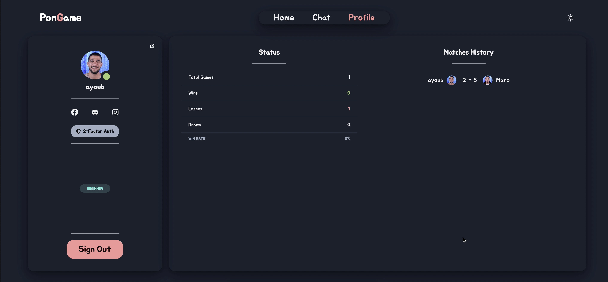

  <image alt="img" src="imgs/SigninBlack.png">

# PonGame
PonGame is a webapplication made using ReactJS and NestJS where you can play or watch pong with players among other things such as moderated chatting rooms, private messages, friends list, profile customization, a JWT/2fa system for security, a match-making system and a spectating system to watch your friends play against each other.

PonGame was made using these following Technologies:
- **ReactJS**
- **ChakraUI**
- **NestJS**
- **PostgreSQL**
- **PassportJWT (JWT Authenticator)**
- **Prisma ORM**
- **Docker**

# Build and Run
- **Replace the .env-sample fields and rename the file to .env**
- **Using ``docker-compose up`` run the build and wait patiently**
- **Go to ``HOST`` and ``PORT`` that you inserted in .env and ENJOY**

# Screenshots

  # MADE BY
  
  <!-- ALL-CONTRIBUTORS-LIST:START - Do not remove or modify this section -->
<!-- prettier-ignore-start -->
<!-- markdownlint-disable -->
<table>
  <tr>
    <td align="center"><a href="https://github.com/MaroIsLife/"> <b>Marouane Ougnou</b></a> </td>
    <td align="center"><a href="https://github.com/AyoubMaatouch/"> <b>Ayoub Maatouch</b></a> </td>
    <td align="center"><a href="https://github.com/mallah-elmehdi/"> <b>Mehdi El Mallah</b></a> </td>
    <td align="center"><a href="https://github.com/yssefnoam/"> <b>Youssef Noam</b></a> </td>
  </tr>
</table>
<!-- markdownlint-restore -->
<!-- prettier-ignore-end -->
<!-- ALL-CONTRIBUTORS-LIST:END -->
